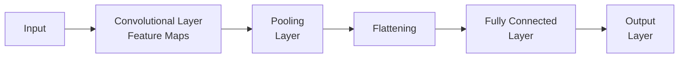
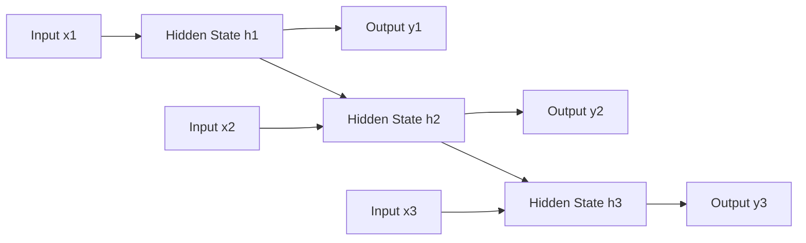

> ##### TIP
>
> To view the TikZ graphs render clearly, please use light mode. 
{: .block-tip }

# Introduction
Neural networks have revolutionized fields ranging from computer vision to natural language processing. This blog provides an intuitive and mathematical understanding of Neural Networks (NNs), Convolutional Neural Networks (CNNs), and Recurrent Neural Networks (RNNs). 

---

# Neural Networks: The Foundation
A neural network is a computational model inspired by the human brain. It consists of layers of interconnected "neurons," each performing a weighted summation followed by a non-linear activation function.

## Mathematical Representation
Consider an input vector $$ \mathbf{x}\in\mathbb{R}^n $$, weights $$ \mathbf{W}\in\mathbb{R}^{m\times n} $$, biases $$ \mathbf{b}\in\mathbb{R}^m $$, and activation function $$ f(\cdot) $$. The output of a single layer is:
$$
\mathbf{h} = f(\mathbf{W}\mathbf{x} + \mathbf{b})
$$

Stacking these layers allows the network to learn hierarchical representations:
$$
\mathbf{h}^{(k+1)} = f(\mathbf{W}^{(k)} \mathbf{h}^{(k)} + \mathbf{b}^{(k)})
$$

The figure below illustrates this "stacking" process:

## Key Intuitions
Neural networks approximate functions by learning parameters (weights and biases) through backpropagation, minimizing a loss function (e.g., Mean Squared Error or Cross-Entropy Loss).

---

# Convolutional Neural Networks (CNNs): Spatial Data Specialists
CNNs are specialized for data with spatial structure, like images. Instead of fully connected layers, they use convolutional layers to extract local patterns, such as edges in images (corresponding to shapes in the image). Multiple layers involve in this process. 

## Mathematical Representation
A convolution operation involves a filter (or kernel) $$ \mathbf{K} \in \mathbb{R}^{k \times k} $$ sliding over the input $$ \mathbf{X} \in \mathbb{R}^{n \times n} $$:
$$
(\mathbf{X} * \mathbf{K})_{ij} = \sum_{p=0}^{k-1}\sum_{q=0}^{k-1} \mathbf{X}_{i+p, j+q} \mathbf{K}_{p, q}
$$

The output is called a **feature map**. The figure below illustrates this process:

Pooling layers (e.g., max pooling) then downsample these feature maps, reducing dimensionality:

The flattening process converts the feature maps in $$ \mathbb{R}^{H \times W \times D} $$ to an one-dimensional vector (e.g., in $$ \mathbb{R}^{K} $$): 

Lastly, a fully connected layer connects the vector to the output layer: 
$$
\mathbf{h}^{(k+1)} = f(\mathbf{W}^{(k)} \mathbf{h}^{(k)} + \mathbf{b}^{(k)})
$$

## Key Intuitions
- **Locality**: Convolutions focus on local patches of data.
- **Shared Weights**: The same filter is applied across the input, reducing the number of parameters.
- **Hierarchical Features**: Layers capture increasingly complex features (e.g., edges → textures → objects).

---

# Recurrent Neural Networks (RNNs): Temporal Data Specialists
RNNs excel at processing sequential data, such as time series or text. They maintain a "memory" of previous inputs via a hidden state, allowing them to model temporal dependencies. 

## Mathematical Representation
RNNs process data sequentially. At each time step $$ t $$, an input $$ \mathbf{x}_t $$ is provided. The sequence of inputs can be represented as $$ \mathbf{x}_1, \mathbf{x}_2, \dots, \mathbf{x}_T $$, where $$ T $$ is the total number of time steps. RNNs maintain a hidden state \( \mathbf{h}_t \), which acts as the network's memory. This hidden state is updated at each time step based on the current input and the previous hidden state. This hidden state acts as the network's memory. It is updated at each time step based on the current input and the previous hidden state.

Given input $$ \mathbf{x}_t $$, hidden state $$ \mathbf{h}_t $$, and weights $$ \mathbf{W}_{xh} $$, $$ \mathbf{W}_{hh} $$, the hidden state is updated as:
$$
\mathbf{h}_t = f(\mathbf{W}_{xh} \mathbf{x}_t + \mathbf{W}_{hh} \mathbf{h}_{t-1} + \mathbf{b})
$$
The output $$ \mathbf{y}_t $$ is computed as:
$$
\mathbf{y}_t = g(\mathbf{W}_{hy} \mathbf{h}_t + \mathbf{c})
$$

## Key Intuitions
- **Memory**: RNNs use the hidden state to retain information from previous time steps.
- **Shared Parameters**: Parameters are shared across time steps, making RNNs computationally efficient.

## Limitations and Variants
Standard RNNs struggle with long-term dependencies due to vanishing gradients. Variants like LSTMs (Long Short-Term Memory) and GRUs (Gated Recurrent Units) address this by introducing gating mechanisms.

---

# Comparison

<table style="width:100%; border-collapse: collapse; border: 1px solid currentColor;">
  <thead>
    <tr style="border-bottom: 2px solid currentColor;">
      <th style="border-bottom: 1px solid currentColor; padding: 8px;">Feature</th>
      <th style="border-bottom: 1px solid currentColor; padding: 8px;">NN</th>
      <th style="border-bottom: 1px solid currentColor; padding: 8px;">CNN</th>
      <th style="border-bottom: 1px solid currentColor; padding: 8px;">RNN</th>
    </tr>
  </thead>
  <tbody>
    <tr style="border-bottom: 1px solid currentColor;">
      <td style="padding: 8px;">Data Type</td>
      <td style="padding: 8px;">General</td>
      <td style="padding: 8px;">Spatial (e.g., images)</td>
      <td style="padding: 8px;">Sequential (e.g., text)</td>
    </tr>
    <tr style="border-bottom: 1px solid currentColor;">
      <td style="padding: 8px;">Key Operation</td>
      <td style="padding: 8px;">Weighted Summation</td>
      <td style="padding: 8px;">Convolution</td>
      <td style="padding: 8px;">Recurrence</td>
    </tr>
    <tr style="border-bottom: 1px solid currentColor;">
      <td style="padding: 8px;">Parameter Sharing</td>
      <td style="padding: 8px;">None</td>
      <td style="padding: 8px;">Across spatial locations</td>
      <td style="padding: 8px;">Across time steps</td>
    </tr>
    <tr>
      <td style="padding: 8px;">Strength</td>
      <td style="padding: 8px;">Universal Approximation</td>
      <td style="padding: 8px;">Spatial Pattern Extraction</td>
      <td style="padding: 8px;">Temporal Dependencies</td>
    </tr>
  </tbody>
</table>

